# API reference

- [API reference](#api-reference)
  - [Week 01](#week-01)
    - [importlib](#importlib)
    - [argparse](#argparse)
    - [time](#time)
    - [numpy](#numpy)
    - [matplotlib](#matplotlib)
    - [torch](#torch)
    - [unittest](#unittest)
    - [pytest](#pytest)

## Week 01

### importlib

- [`importlib.import_module`](https://docs.python.org/3/library/importlib.html#importlib.import_module) - Imports a module given its dotted name as a string and returns the module object; useful when the module to load is only known at runtime.

```python
import importlib

math_module = importlib.import_module("math")
print(math_module.sqrt(16))
```

```text
4.0
```

### argparse

- [`argparse.ArgumentParser`](https://docs.python.org/3/library/argparse.html#argparse.ArgumentParser) - Builds a command-line argument parser that arguments are registered on and command lines are parsed with.
- [`argparse.ArgumentParser.add_argument`](https://docs.python.org/3/library/argparse.html#argparse.ArgumentParser.add_argument) - Registers one command-line argument on the parser, including its flags, type, and default value.
- [`argparse.ArgumentParser.parse_args`](https://docs.python.org/3/library/argparse.html#argparse.ArgumentParser.parse_args) - Parses a list of command-line argument strings (`sys.argv` by default) into a `Namespace` object with one attribute per registered argument.

```python
import argparse

parser = argparse.ArgumentParser()
parser.add_argument("-w", "--week", type=int, default=1)
args = parser.parse_args(["--week", "5"])
print(args.week)
```

```text
5
```

### time

- [`time.time`](https://docs.python.org/3/library/time.html#time.time) - Returns the current time in seconds since the epoch, as a float; subtracting two calls measures elapsed wall-clock time.

```python
import time

start = time.time()
total = sum(range(1_000_000))
elapsed = time.time() - start
print(total)
print(elapsed >= 0)
```

```text
499999500000
True
```

### numpy

> [!NOTE]
> A third-party package; install it with `pip install numpy` before importing.

- [`numpy.array`](https://numpy.org/doc/stable/reference/generated/numpy.array.html#numpy.array) - Creates an array from a Python sequence (or nested sequences), inferring shape and dtype.

```python
import numpy as np

print(np.array([1, 2, 3]))
```

```text
[1 2 3]
```

- [`numpy.ndarray.shape`](https://numpy.org/doc/stable/reference/generated/numpy.ndarray.shape.html#numpy.ndarray.shape) - The length of the array along each axis, as a tuple.
- [`numpy.ndarray.dtype`](https://numpy.org/doc/stable/reference/generated/numpy.ndarray.dtype.html#numpy.ndarray.dtype) - The data type of the array's elements.
- [`numpy.ndarray.ndim`](https://numpy.org/doc/stable/reference/generated/numpy.ndarray.ndim.html#numpy.ndarray.ndim) - The number of axes (dimensions) of the array.
- [`numpy.ndarray.size`](https://numpy.org/doc/stable/reference/generated/numpy.ndarray.size.html#numpy.ndarray.size) - The total number of elements in the array, across all axes.

```python
import numpy as np

m = np.array([[1, 2, 3], [4, 5, 6]])
print(m.shape, m.dtype, m.ndim, m.size)
```

```text
(2, 3) int64 2 6
```

- [`numpy.arange`](https://numpy.org/doc/stable/reference/generated/numpy.arange.html#numpy.arange) - Returns evenly spaced values within a half-open interval, like `range` but as an array.

```python
import numpy as np

print(np.arange(5))
```

```text
[0 1 2 3 4]
```

- [`numpy.ndarray.T`](https://numpy.org/doc/stable/reference/generated/numpy.ndarray.T.html#numpy.ndarray.T) - The array with its axes transposed (rows and columns swapped, for a 2D array).

```python
import numpy as np

m = np.array([[1, 2, 3], [4, 5, 6]])
print(m.T)
```

```text
[[1 4]
 [2 5]
 [3 6]]
```

- [`numpy.ndarray.reshape`](https://numpy.org/doc/stable/reference/generated/numpy.ndarray.reshape.html#numpy.ndarray.reshape) - Returns the same data in a new shape, without copying when possible.

```python
import numpy as np

print(np.arange(6).reshape(2, 3))
```

```text
[[0 1 2]
 [3 4 5]]
```

- [`numpy.ndarray.mean`](https://numpy.org/doc/stable/reference/generated/numpy.ndarray.mean.html#numpy.ndarray.mean) - The arithmetic mean of the array's elements, over the whole array or along an axis.
- [`numpy.ndarray.std`](https://numpy.org/doc/stable/reference/generated/numpy.ndarray.std.html#numpy.ndarray.std) - The standard deviation of the array's elements, over the whole array or along an axis.
- [`numpy.ndarray.min`](https://numpy.org/doc/stable/reference/generated/numpy.ndarray.min.html#numpy.ndarray.min) - The smallest element of the array, over the whole array or along an axis.
- [`numpy.ndarray.max`](https://numpy.org/doc/stable/reference/generated/numpy.ndarray.max.html#numpy.ndarray.max) - The largest element of the array, over the whole array or along an axis.
- [`numpy.ndarray.sum`](https://numpy.org/doc/stable/reference/generated/numpy.ndarray.sum.html#numpy.ndarray.sum) - The sum of the array's elements, over the whole array or along an axis.

```python
import numpy as np

v = np.array([1.0, 2.0, 3.0, 4.0])
print(v.mean(), v.std(), v.min(), v.max(), v.sum())
```

```text
2.5 1.118033988749895 1.0 4.0 10.0
```

- [`numpy.linspace`](https://numpy.org/doc/stable/reference/generated/numpy.linspace.html#numpy.linspace) - Returns a fixed number of evenly spaced values between two endpoints, inclusive of both by default.

```python
import numpy as np

print(np.linspace(0, 1, 5))
```

```text
[0.   0.25 0.5  0.75 1.  ]
```

- [`numpy.sin`](https://numpy.org/doc/stable/reference/generated/numpy.sin.html#numpy.sin) - Elementwise sine, in radians.
- [`numpy.cos`](https://numpy.org/doc/stable/reference/generated/numpy.cos.html#numpy.cos) - Elementwise cosine, in radians.

```python
import numpy as np

angles = np.array([0.0, 1.0, 2.0])
print(np.sin(angles))
print(np.cos(angles))
```

```text
[0.         0.84147098 0.90929743]
[ 1.          0.54030231 -0.41614684]
```

- [`numpy.random.default_rng`](https://numpy.org/doc/stable/reference/random/generator.html#numpy.random.default_rng) - Creates a new, independently seedable random number generator; the modern replacement for the legacy global `numpy.random` state.
- [`numpy.random.Generator.uniform`](https://numpy.org/doc/stable/reference/random/generated/numpy.random.Generator.uniform.html#numpy.random.Generator.uniform) - Draws samples from a uniform distribution over `[low, high)`.
- [`numpy.random.Generator.normal`](https://numpy.org/doc/stable/reference/random/generated/numpy.random.Generator.normal.html#numpy.random.Generator.normal) - Draws samples from a normal (Gaussian) distribution with the given mean and standard deviation.
- [`numpy.random.Generator.exponential`](https://numpy.org/doc/stable/reference/random/generated/numpy.random.Generator.exponential.html#numpy.random.Generator.exponential) - Draws samples from an exponential distribution with the given scale.

```python
import numpy as np

rng = np.random.default_rng(seed=42)
print(rng.uniform(0, 1, 3))
print(rng.normal(0, 1, 3))
print(rng.exponential(1.0, 3))
```

```text
[0.77395605 0.43887844 0.85859792]
[ 0.94056472 -1.95103519 -1.30217951]
[1.40996069 3.12429596 0.0792942 ]
```

- [`numpy.zeros_like`](https://numpy.org/doc/stable/reference/generated/numpy.zeros_like.html#numpy.zeros_like) - Returns an array of zeros with the same shape and dtype as the input.

```python
import numpy as np

print(np.zeros_like(np.array([1.0, 2.0])))
```

```text
[0. 0.]
```

- [`numpy.testing.assert_allclose`](https://numpy.org/doc/stable/reference/generated/numpy.testing.assert_allclose.html#numpy.testing.assert_allclose) - Raises `AssertionError` unless two arrays are equal within a relative and absolute tolerance.

```python
import numpy as np

np.testing.assert_allclose(np.array([1.0]), np.array([1.0]))
print("arrays match")
```

```text
arrays match
```

### matplotlib

> [!NOTE]
> A third-party package; install it with `pip install matplotlib` before importing.

- [`matplotlib.axes.Axes.scatter`](https://matplotlib.org/stable/api/_as_gen/matplotlib.axes.Axes.scatter.html#matplotlib.axes.Axes.scatter) - Draws a marker at each `(x, y)` point, unconnected; the way to show individual samples rather than a trend line.

```python
import matplotlib

matplotlib.use("Agg")
import matplotlib.pyplot as plt

figure, axis = plt.subplots()
axis.scatter([1, 2, 3, 4, 5], [2, 4, 5, 4, 6])
```

Without: 
With:    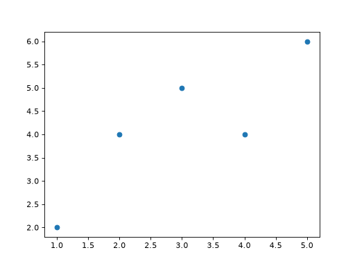

- [`matplotlib.axes.Axes.hist`](https://matplotlib.org/stable/api/_as_gen/matplotlib.axes.Axes.hist.html#matplotlib.axes.Axes.hist) - Bins a sequence of values and draws a bar per bin; the way to show a distribution's shape.

```python
import matplotlib

matplotlib.use("Agg")
import matplotlib.pyplot as plt
import numpy as np

rng = np.random.default_rng(seed=42)
figure, axis = plt.subplots()
axis.hist(rng.normal(size=1000), bins=30)
```

Without: 
With:    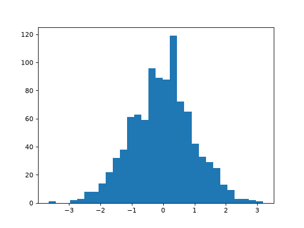

- [`matplotlib.axes.Axes.grid`](https://matplotlib.org/stable/api/_as_gen/matplotlib.axes.Axes.grid.html#matplotlib.axes.Axes.grid) - Toggles gridlines at the axis tick positions, making values easier to read off a plot.

```python
import matplotlib

matplotlib.use("Agg")
import matplotlib.pyplot as plt

figure, axis = plt.subplots()
axis.plot([0, 1, 2, 3], [1.0, 0.6, 0.35, 0.2])
axis.grid(True)
```

Without: 
With:    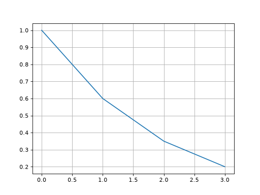

- [`matplotlib.pyplot.subplots`](https://matplotlib.org/stable/api/_as_gen/matplotlib.pyplot.subplots.html#matplotlib.pyplot.subplots) - Creates a figure and a grid of axes in one call, returning `(figure, axes)`; `figsize` sets the size in inches.

```python
import matplotlib

matplotlib.use("Agg")
import matplotlib.pyplot as plt

figure, axes = plt.subplots(1, 3, figsize=(12, 4))
print(axes.shape)
```

```text
(3,)
```

- [`matplotlib.axes.Axes.plot`](https://matplotlib.org/stable/api/_as_gen/matplotlib.axes.Axes.plot.html#matplotlib.axes.Axes.plot) - Draws a line through the `(x, y)` points on the axes; the way to show a quantity over a sequence such as a value per epoch.

```python
import matplotlib

matplotlib.use("Agg")
import matplotlib.pyplot as plt

figure, axis = plt.subplots()
axis.plot([0, 1, 2, 3], [1.0, 0.6, 0.35, 0.2])
```

Without: 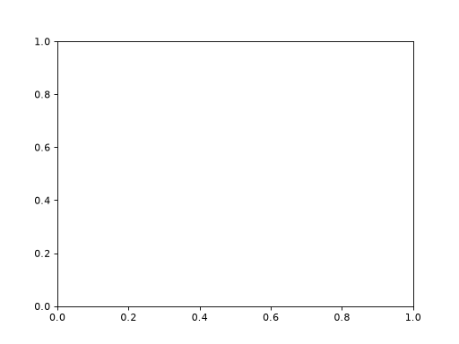
With:    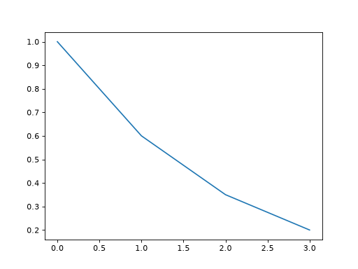

- [`matplotlib.axes.Axes.legend`](https://matplotlib.org/stable/api/_as_gen/matplotlib.axes.Axes.legend.html#matplotlib.axes.Axes.legend) - Draws a key mapping each line's `label` to its colour, so multiple series on one axes can be told apart.

```python
import matplotlib

matplotlib.use("Agg")
import matplotlib.pyplot as plt

figure, axis = plt.subplots()
axis.plot([0, 1, 2, 3], [1.0, 0.6, 0.35, 0.2], label="train")
axis.plot([0, 1, 2, 3], [0.9, 0.7, 0.55, 0.5], label="validation")
axis.legend()
```

Without: 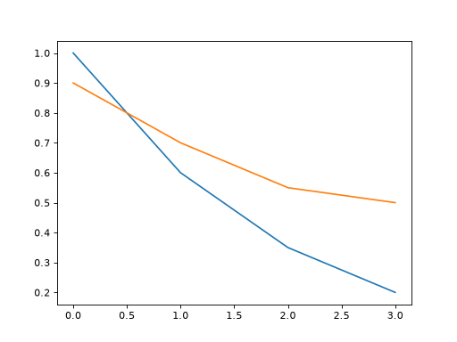
With:    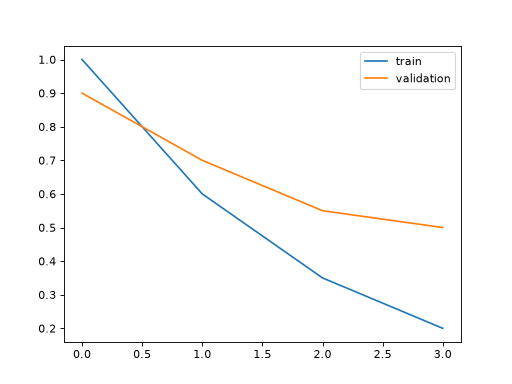

- [`matplotlib.axes.Axes.set_title`](https://matplotlib.org/stable/api/_as_gen/matplotlib.axes.Axes.set_title.html#matplotlib.axes.Axes.set_title) - Sets the title drawn above the axes.

```python
import matplotlib

matplotlib.use("Agg")
import matplotlib.pyplot as plt

figure, axis = plt.subplots()
axis.plot([0, 1, 2, 3], [1.0, 0.6, 0.35, 0.2])
axis.set_title("Training loss")
```

Without: 
With:    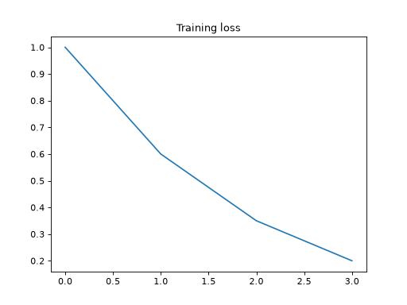

- [`matplotlib.axes.Axes.set_xlabel`](https://matplotlib.org/stable/api/_as_gen/matplotlib.axes.Axes.set_xlabel.html#matplotlib.axes.Axes.set_xlabel) - Sets the label drawn under the x-axis.

```python
import matplotlib

matplotlib.use("Agg")
import matplotlib.pyplot as plt

figure, axis = plt.subplots()
axis.plot([0, 1, 2, 3], [1.0, 0.6, 0.35, 0.2])
axis.set_xlabel("epoch")
```

Without: 
With:    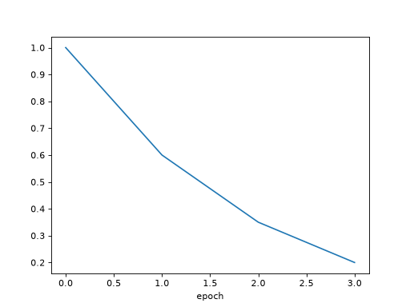

- [`matplotlib.axes.Axes.set_ylabel`](https://matplotlib.org/stable/api/_as_gen/matplotlib.axes.Axes.set_ylabel.html#matplotlib.axes.Axes.set_ylabel) - Sets the label drawn beside the y-axis.

```python
import matplotlib

matplotlib.use("Agg")
import matplotlib.pyplot as plt

figure, axis = plt.subplots()
axis.plot([0, 1, 2, 3], [1.0, 0.6, 0.35, 0.2])
axis.set_ylabel("loss")
```

Without: 
With:    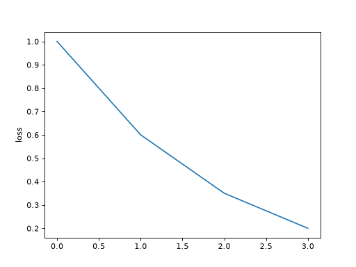

- [`matplotlib.figure.Figure.tight_layout`](https://matplotlib.org/stable/api/_as_gen/matplotlib.figure.Figure.tight_layout.html#matplotlib.figure.Figure.tight_layout) - Adjusts the spacing between subplots so titles and labels no longer overlap.

```python
import matplotlib

matplotlib.use("Agg")
import matplotlib.pyplot as plt

figure, axes = plt.subplots(2, 2)
for axis in axes.flat:
    axis.plot([0, 1, 2, 3], [1.0, 0.6, 0.35, 0.2])
    axis.set_title("a fairly long subplot title")
    axis.set_ylabel("vertical axis label")
figure.tight_layout()
```

Without: 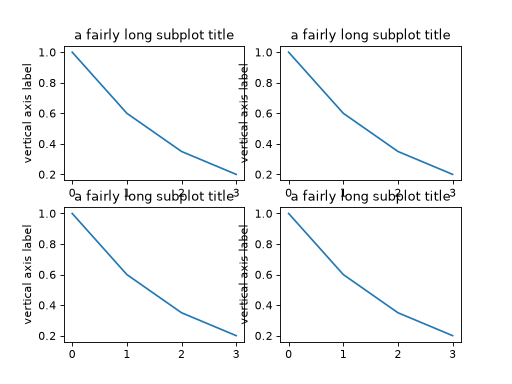
With:    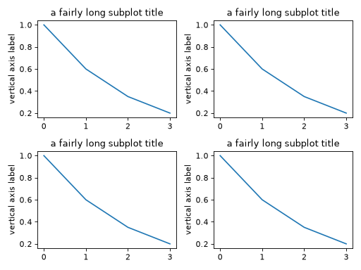

- [`matplotlib.pyplot.show`](https://matplotlib.org/stable/api/_as_gen/matplotlib.pyplot.show.html#matplotlib.pyplot.show) - Displays all open figures in a window; under a non-interactive backend such as `'Agg'` it is a no-op.

```python
import matplotlib

matplotlib.use("Agg")
import matplotlib.pyplot as plt

figure, axis = plt.subplots()
axis.plot([0, 1, 2, 3], [1.0, 0.6, 0.35, 0.2])
plt.show()
print("show() returned without opening a window under the Agg backend")
```

```text
show() returned without opening a window under the Agg backend
```

### torch

> [!NOTE]
> A third-party package; install it with `pip install torch` before importing.

- [`torch.from_numpy`](https://pytorch.org/docs/stable/generated/torch.from_numpy.html#torch.from_numpy) - Wraps a NumPy array in a tensor that shares the same underlying memory, without copying.
- [`torch.Tensor.dtype`](https://pytorch.org/docs/stable/generated/torch.Tensor.dtype.html#torch.Tensor.dtype) - The data type of the tensor's elements.

```python
import numpy as np
import torch

array = np.array([[1.0, 2.0, 3.0], [4.0, 5.0, 6.0]])
tensor = torch.from_numpy(array)
print(tensor)
print(tensor.dtype)
```

```text
tensor([[1., 2., 3.],
        [4., 5., 6.]], dtype=torch.float64)
torch.float64
```

- [`torch.Tensor.shape`](https://pytorch.org/docs/stable/generated/torch.Tensor.shape.html#torch.Tensor.shape) - The size of the tensor along each dimension, as a `torch.Size`; index it (e.g. `shape[0]`) to read one dimension such as the batch size.

```python
import torch

print(torch.zeros(2, 3).shape)
```

```text
torch.Size([2, 3])
```

- [`torch.device`](https://docs.pytorch.org/docs/stable/tensor_attributes.html#torch-device) - The device on which a tensor is or will be allocated.

```python
import torch

# NVIDIA GPU / CUDA
print("CUDA available:", torch.cuda.is_available())

# Apple Silicon GPU / MPS
print("MPS available:", torch.backends.mps.is_available())

# Pick the best available device
if torch.cuda.is_available():
    device = torch.device("cuda")
elif torch.backends.mps.is_available():
    device = torch.device("mps")
else:
    device = torch.device("cpu")

print("Using:", device)
```

- [`torch.Tensor.device`](https://pytorch.org/docs/stable/generated/torch.Tensor.device.html#torch.Tensor.device) - The device a tensor currently lives on; read it to create new tensors on the same device.

```python
import torch

print(torch.zeros(3).device)
```

```text
cpu
```

- [`torch.Tensor.to`](https://docs.pytorch.org/docs/stable/generated/torch.Tensor.to.html#torch.Tensor.to) - Returns a tensor converted to the specified device and/or data type.

```python
tensor = tensor.to(device)
print(tensor.device)
```

### unittest

Each entry shows the function under test in one block and, in a second block, a `unittest.TestCase` exercising it - following the course's Given-When-Then structure, `expected_*`/`actual_*` naming, and `test_when_..._then_...` test names. Run the tests with `pytest`.

- [`unittest.TestCase`](https://docs.python.org/3/library/unittest.html#unittest.TestCase) - Base class for tests; subclass it, add `test_*` methods, and use its `assert*` helpers to check conditions.

```python
# calculator.py
def add(first: int, second: int) -> int:
    """Add two integers.

    :param int first: the first addend
    :param int second: the second addend
    :return int: their sum
    """
    return first + second
```

```python
# tests/test_calculator.py
import unittest

from calculator import add


class TestAdd(unittest.TestCase):
    def test_when_the_operands_are_positive_then_it_returns_their_sum(self):
        # Given: two positive operands
        first = 2
        second = 3
        expected_sum = 5

        # When: we add them
        actual_sum = add(first, second)

        # Then: it returns their sum
        self.assertEqual(actual_sum, expected_sum)
```

- [`unittest.TestCase.setUp`](https://docs.python.org/3/library/unittest.html#unittest.TestCase.setUp) - Runs immediately before every test method in the class; the place to build state a test needs, such as saving a value that a test is about to mutate.

```python
# feature_flags.py
_FLAGS: dict[str, bool] = {"debug": False}


def set_flag(name: str, value: bool) -> None:
    """Set a named feature flag.

    :param str name: the flag to set
    :param bool value: the new value for the flag
    :return None:
    """
    _FLAGS[name] = value


def get_flag(name: str) -> bool:
    """Read a named feature flag.

    :param str name: the flag to read
    :return bool: the flag's current value
    """
    return _FLAGS[name]
```

```python
# tests/test_feature_flags.py
import unittest

from feature_flags import get_flag, set_flag


class TestSetFlag(unittest.TestCase):
    def setUp(self) -> None:
        # Given: the flag's original value, saved so it can be restored
        self.original_value = get_flag("debug")

    def tearDown(self) -> None:
        set_flag("debug", self.original_value)

    def test_when_the_flag_is_set_to_true_then_get_flag_returns_true(self):
        # Given: the flag under test
        flag_name = "debug"
        expected_value = True

        # When: we set it to True
        set_flag(flag_name, expected_value)
        actual_value = get_flag(flag_name)

        # Then: reading it back returns True
        self.assertEqual(actual_value, expected_value)
```

- [`unittest.TestCase.tearDown`](https://docs.python.org/3/library/unittest.html#unittest.TestCase.tearDown) - Runs immediately after every test method, even if it failed; the place to undo state a test changed, such as restoring a saved value.

```python
# feature_flags.py
_FLAGS: dict[str, bool] = {"debug": False}


def set_flag(name: str, value: bool) -> None:
    """Set a named feature flag.

    :param str name: the flag to set
    :param bool value: the new value for the flag
    :return None:
    """
    _FLAGS[name] = value


def get_flag(name: str) -> bool:
    """Read a named feature flag.

    :param str name: the flag to read
    :return bool: the flag's current value
    """
    return _FLAGS[name]
```

```python
# tests/test_feature_flags.py
import unittest

from feature_flags import get_flag, set_flag


class TestSetFlag(unittest.TestCase):
    def setUp(self) -> None:
        self.original_value = get_flag("debug")

    def tearDown(self) -> None:
        # Then: the flag is restored regardless of the test's outcome
        set_flag("debug", self.original_value)

    def test_when_the_flag_is_set_to_true_then_get_flag_returns_true(self):
        # Given: the flag under test
        flag_name = "debug"
        expected_value = True

        # When: we set it to True
        set_flag(flag_name, expected_value)
        actual_value = get_flag(flag_name)

        # Then: reading it back returns True
        self.assertEqual(actual_value, expected_value)
```

- [`unittest.TestCase.assertEqual`](https://docs.python.org/3/library/unittest.html#unittest.TestCase.assertEqual) - Fails the test unless the two arguments are equal (`==`).

```python
# calculator.py
def add(first: int, second: int) -> int:
    """Add two integers.

    :param int first: the first addend
    :param int second: the second addend
    :return int: their sum
    """
    return first + second
```

```python
# tests/test_calculator.py
import unittest

from calculator import add


class TestAdd(unittest.TestCase):
    def test_when_the_operands_are_positive_then_it_returns_their_sum(self):
        # Given: two positive operands
        first = 2
        second = 3
        expected_sum = 5

        # When: we add them
        actual_sum = add(first, second)

        # Then: it returns their sum
        self.assertEqual(actual_sum, expected_sum)
```

- [`unittest.TestCase.assertIn`](https://docs.python.org/3/library/unittest.html#unittest.TestCase.assertIn) - Fails the test unless the member is found in the container.

```python
# tokenizer.py
def tokenize(text: str) -> list[str]:
    """Split text into whitespace-separated tokens.

    :param str text: the text to tokenize
    :return list[str]: the tokens, in order
    """
    return text.split()
```

```python
# tests/test_tokenizer.py
import unittest

from tokenizer import tokenize


class TestTokenize(unittest.TestCase):
    def test_when_the_text_contains_a_word_then_that_word_is_among_the_tokens(self):
        # Given: text containing the word "world"
        text = "hello world"
        expected_token = "world"

        # When: we tokenize it
        actual_tokens = tokenize(text)

        # Then: the word is among the tokens
        self.assertIn(expected_token, actual_tokens)
```

- [`unittest.TestCase.assertAlmostEqual`](https://docs.python.org/3/library/unittest.html#unittest.TestCase.assertAlmostEqual) - Fails the test unless the two numbers are equal after rounding the difference to a number of decimal places (7 by default), tolerating float rounding error.

```python
# stats.py
def mean(values: list[float]) -> float:
    """Compute the arithmetic mean of a list of numbers.

    :param list[float] values: the numbers to average
    :return float: their arithmetic mean
    """
    return sum(values) / len(values)
```

```python
# tests/test_stats.py
import unittest

from stats import mean


class TestMean(unittest.TestCase):
    def test_when_given_three_values_then_it_returns_their_average(self):
        # Given: three values whose average is not exactly representable
        values = [0.1, 0.2, 0.3]
        expected_mean = 0.2

        # When: we compute the mean
        actual_mean = mean(values)

        # Then: it equals the average within floating-point tolerance
        self.assertAlmostEqual(actual_mean, expected_mean)
```

### pytest

> [!NOTE]
> A third-party package; install it with `pip install pytest` before importing.

Each entry shows the function under test in one block and, in a second block, a `unittest.TestCase` exercising it via a `pytest` API - following the course's Given-When-Then structure, `expected_*`/`actual_*` naming, and `test_when_..._then_...` test names. Run the tests with `pytest`.

- [`pytest.fixture`](https://docs.pytest.org/en/stable/reference/reference.html#pytest.fixture) - Marks a function as a fixture factory that pytest injects into a test by matching the test's parameter name; `autouse=True` injects it into every test in the class without being requested by name.

```python
# greeting.py
def greet(name: str) -> None:
    """Print a friendly greeting to standard output.

    :param str name: the name to greet
    :return None:
    """
    print(f"Hello, {name}!")
```

```python
# tests/test_greeting.py
import unittest

import pytest

from greeting import greet


class TestGreet(unittest.TestCase):
    @pytest.fixture(autouse=True)
    def inject_fixtures(self, capsys):
        # Given: pytest's capsys fixture, made available on self
        self.capsys = capsys

    def test_when_called_with_a_name_then_it_prints_a_greeting(self):
        # Given: a name to greet
        name = "Ada"
        expected_greeting = "Hello, Ada!"

        # When: we greet it
        greet(name)
        actual_output = self.capsys.readouterr().out

        # Then: the greeting appears on standard output
        self.assertIn(expected_greeting, actual_output)
```

- [`pytest.CaptureFixture.readouterr`](https://docs.pytest.org/en/stable/reference/reference.html#pytest.CaptureFixture.readouterr) - Reads everything written to standard output and standard error since the last call (or the test's start), resetting the internal buffer; the `capsys` fixture returns an object with this method.

```python
# greeting.py
def greet(name: str) -> None:
    """Print a friendly greeting to standard output.

    :param str name: the name to greet
    :return None:
    """
    print(f"Hello, {name}!")
```

```python
# tests/test_greeting.py
import unittest

import pytest

from greeting import greet


class TestGreet(unittest.TestCase):
    @pytest.fixture(autouse=True)
    def inject_fixtures(self, capsys):
        self.capsys = capsys

    def test_when_called_with_a_name_then_it_prints_a_greeting(self):
        # Given: a name to greet
        name = "Ada"
        expected_greeting = "Hello, Ada!"

        # When: we greet it, then read what was captured
        greet(name)
        actual_output = self.capsys.readouterr().out

        # Then: the greeting appears on standard output
        self.assertIn(expected_greeting, actual_output)
```

- [`pytest.raises`](https://docs.pytest.org/en/stable/reference/reference.html#pytest.raises) - Context manager that fails the test unless the code inside its block raises an exception of the given type.

```python
# divider.py
def divide(numerator: float, denominator: float) -> float:
    """Divide one number by another.

    :param float numerator: the value to divide
    :param float denominator: the value to divide by
    :return float: the quotient
    :raises ZeroDivisionError: if denominator is zero
    """
    return numerator / denominator
```

```python
# tests/test_divider.py
import unittest

import pytest

from divider import divide


class TestDivide(unittest.TestCase):
    def test_when_denominator_is_zero_then_zero_division_error_is_raised(self):
        # Given: a denominator of zero
        numerator = 4.0
        denominator = 0.0

        # When/Then: dividing by it raises ZeroDivisionError
        with pytest.raises(ZeroDivisionError) as exc:
            divide(numerator, denominator)

        # Then: validate the text of the error in some way
        self.assertEqual(exc.value, "Cannot divide by 0!")
```
