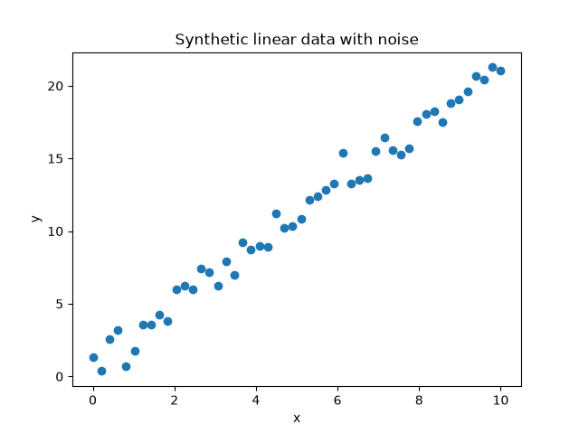
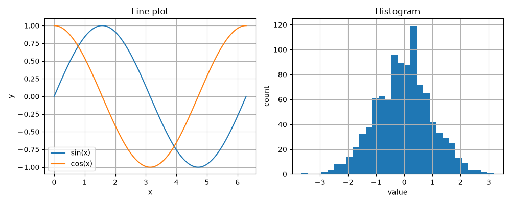
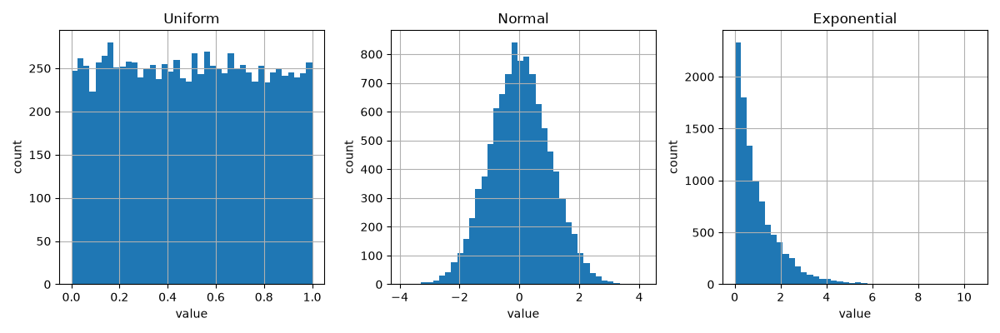

# Introduction to Deep Learning

- [Introduction to Deep Learning](#introduction-to-deep-learning)
  - [Week 01 - Introduction to NumPy, Matplotlib and PyTorch](#week-01---introduction-to-numpy-matplotlib-and-pytorch)
    - [Creating the task runway](#creating-the-task-runway)
      - [Task 01](#task-01)
      - [Task 02](#task-02)
      - [Task 03](#task-03)
      - [Task 04](#task-04)
      - [Task 05](#task-05)
    - [Numpy](#numpy)
      - [Task 06](#task-06)
      - [Task 07](#task-07)
      - [Task 08](#task-08)
      - [Task 09](#task-09)
      - [Task 10](#task-10)
    - [Matplotlib](#matplotlib)
      - [Task 11](#task-11)
      - [Task 12](#task-12)
      - [Task 13](#task-13)
      - [Task 14](#task-14)
    - [PyTorch](#pytorch)
      - [Task 15](#task-15)

## Week 01 - Introduction to NumPy, Matplotlib and PyTorch

### Creating the task runway

Let's say we start building a big project entirely in Python.

<details>
<summary>Where do we store external Python packages?</summary>

The best way is to create a local folder, per project, and put all of the packages there.

<details>
<summary>Why not just store them in a global folder?</summary>

- Because different projects may require different versions of the same package.
- Maybe the version of Python itself is different.

</details>

<details>
<summary>What is this local folder called?</summary>

Virtual environment.

</details>

</details>

<details>
<summary>What package do we use to install other packages?</summary>

- `pip` - it is included into the Python installation that's usually done.
- You can find all publicly available packages in [the Python Package Index](https://pypi.org/).

</details>

<details>
<summary>How do we create virtual environments in Python?</summary>

1. Open the directory in which you want the virtual environment to be.
2. We create the local folder: `python3 -m venv .venv`.
3. We activate the environment so that `pip` knows we're in a local folder: `source .venv/bin/activate`.

<details>
<summary>What is <code>python -m</code>?</summary>

It's a way of invoking a module/package from the command-line, instead of creating a script and importing it there.

</details>

<details>
<summary>What is <code>venv</code> (without the dot)?</summary>

It is the name of the module/package being invoked.

</details>

<details>
<summary>What is <code>.venv</code>?</summary>

It is the name of the local folder we were talking about, i.e. the name of the virtual environment.

</details>

</details>

#### Task 01

**Description:**

Let's set up our development environment. In case you have not done so already, please:

1. Clone the repository.
2. Create a new Python virtual environment in a folder named `.venv`.
3. Install the packages in `requirements.txt`.

**Acceptance criteria:**

- A new Python virtual environment is created with all packages specified in `requirements.txt`.

**Test case:**

```bash
source .venv/bin/activate
```

```bash
# The text "(.venv)" should appear in the beginning of the terminal line, ex: "(.venv) work@work DL % "
```

<details>
<summary>What is the first step to take when writing code / solving a task?</summary>

We should ensure we understand what has to be achieved.

</details>

<details>
<summary>What is the easiest way to do that?</summary>

We think in terms of **the client**. What current ***behavior*** (or behaviors) of our system would need to change to satisfy the user.

The client/user is extremely important! Always keep their expectations in your head when writing code.

</details>

<details>
<summary>What is the next step?</summary>

Even though we have a general understanding of what has to change, it may be too abstract, too complex. We should now decide what is the next minimal ***increment*** that we have to implement.

</details>

<details>
<summary>What is special about it?</summary>

It has to be ***the smallest set of changes*** that would have added value in getting us to the goal while at the same time allowing us to ***go to Production*** without breaking anything!

</details>

<details>
<summary>What is the next step?</summary>

We write tests!

</details>

<details>
<summary>But why now?</summary>

Because this allows us to document the new behavior. Think of it like this:

- we see a bug in Production;
- we open up the codebase;
- we fix the bug;
- we write a test for the bug.

<details>
<summary>How would we know if the test truly captures the buggy behavior?</summary>

To truly know this, we must:

1. Bring back the bug / Comment out our solution.
2. Run the test to ensure that it is ***RED*** (i.e. it fails).
3. Bring back our fix.
4. Run the test again to ensure that it is now ***GREEN*** (i.e. that it passes).

</details>

Well, why do all of this, when we can just start with the test always? We'll do exactly that!

</details>

But then, we have to ask another question.

<details>
<summary>How do we write tests?</summary>

We always concentrate on the smallest possible ***unit*** (i.e. piece of code / logic) that we can test.

</details>

<details>
<summary>What is that when working with code?</summary>

A function.

</details>

<details>
<summary>How do we test a function?</summary>

- We define a new test `unittest.TestCase` class for that function.
- It represents the set of behaviors, supported by our function.
- We then describe each behavior in a test method.

</details>

<details>
<summary>What if we want to test a whole new class?</summary>

Then we create a new testing module / file and create multiple test classes in it for each of the methods of the class.

</details>

<details>
<summary>Naming tests is hard - how can we do it in a way that is not?</summary>

We use the pattern `test_when_<condition>_then_<expected-behavior>`.

This lets us know exactly what is being validated without even reading the test body and/or the implementation.

> [!NOTE]
> This should be the goal: your tests are good if and only if you can understand how the system works, just by reading their names (no test bodies, no actual implementations).

<details>
<summary>What should the <code>condition</code> part explain?</summary>

Under what conditions the functionality-under-test is invoked / the behavior arises.

</details>

<details>
<summary>What should the <code>expected-behavior</code> part explain?</summary>

The behavior of the functionality-under-test.

</details>

</details>

<details>
<summary>How many behaviors do we define under one test method?</summary>

$1$ - this ensures we write the so-called unit tests.

</details>

<details>
<summary>What about the test method structure - what do we put inside the test method?</summary>

We use the `AAA` pattern (`Arrange`, `Act`, `Assert`):

<details>
<summary>What do we write in <code>Arrange</code>?</summary>

We describe the context for triggering the behavior.

</details>

<details>
<summary>What do we write in <code>Act</code>?</summary>

We trigger the behavior.

<details>
<summary>What does this mean?</summary>

We call the function-under-test with its corresponding parameters.

</details>

</details>

<details>
<summary>What do we write in <code>Assert</code>?</summary>

We ensure that the effects, produced by the behavior, are expected.

</details>

> [!NOTE]
> This is not the only pattern out there - you may also see the pattern `GWT` that literally repeats the test naming pattern inside of the test body: `Arrange -> Given`, `Act -> When`, `Assert -> Then`.

</details>

<details>
<summary>How should we interpret a very big <code>Arrange</code> section?</summary>

This means that the code-under-test is too complex.

</details>

<details>
<summary>How do we solve this?</summary>

We ***REFACTOR*** - we split the function into two smaller ones (starting first with the tests of course!).

</details>

<details>
<summary>What is this type of development called?</summary>

This is ***Behavior-driven development***! You can read more about it [in Wikipedia](https://en.wikipedia.org/wiki/Behavior-driven_development).

> [!NOTE]
> A nice side effect from practicing BDD is that the code coverage will always be $100\%$.

Principles:

1. Write a single test for a new behavior first or modify an existing one if only the behavior is changing.
   - Ensure the name conforms to the convention `test_when_<condition>_then_<expectation>`. Example: `test_when_batch_size_is_negative_then_value_error_is_raised`.
   - A single unit test should test exactly one behavior.
   - Each **class** gets a dedicated **test module** (`test_model_trainer.py`).
   - Each **function/method** gets its own **test class**. One test class per function/method with multiple test methods inside it.
2. Ensure it fails.
3. Make it pass with the simplest implementation possible.
4. Return to `1.` if there are more behaviors to be implemented. Else, ensure all tests pass.

More examples:

```python
# my_package/myclass.py
class MyClass:
    def do_something_with_an_integer(self, param1: int) -> int:
        ...

    def my_second_method(self)
        ...
```

```python
# tests/test_myclass.py
import unittest


class TestDoSomethignWithAnInteger(unittest.TestCase):
    def test_when_called_with_integer_then_returns_integer(self): ...

    def test_when_called_with_string_then_raises_value_error(self): ...


class TestMySecondMethod(unittest.TestCase): ...
```

</details>

<details>
<summary>How do we tell Python that a folder is actually a Python module, not just a plan folder?</summary>

We add a file `__init__.py`. It is usually empty and signals to Python that we can import Python files from it.

</details>

<details>
<summary>How do we run a specific test?</summary>

We use `pytest -svk`:

- `-s`: show test output (otherwise, calling `print` will be captured by `pytest` and you'll not see it);
- `-v`: show test names and their results;
- `-k`: run tests that match this pattern. In essence, if you put the name of the test here, you'll run only it.

</details>

<details>
<summary>How can we run all tests and stop on the first failing one?</summary>

`pytest -x`

</details>

#### Task 02

**Description:**

Explore the contents of the files:

- `.git-hooks/pre-push`: we'd use it guarantee our code is easy to read, safe from bugs and ready for change;
- `pyproject.toml`: the configuration file used by our code formatting tool - [`ruff`](https://docs.astral.sh/ruff/), and our type checking tool - [`pyrefly`](https://pyrefly.org/);
- `.vscode/extensions.json`: recommended extensions for you to install in Visual Studio Code to have a smoother development experience throughout the course. Copy and paste their names in the tab `Extension` in VSCode to install them;
- `.coveragerc`: the configuration file for the tool running our tests and measuring the amount of code executed: `coverage`.

Particularly in `.coveragerc` you'll see the folder which we'd create to store all of our code - `weeks`.

Since we'd have many Python modules (for the tasks), it'd be tedious to execute each of them by hand. To handle this, in this task we'll start setting up a module that would be able to parse command-line arguments for the task we'd like to execute (`-t`) and the week that the task is from (`-w`). To facilitate this, we'll:

1. Create a module `run.py` in the root directory.
2. It'd call a module `weeks/main.py` that'd then parse the command-line arguments `-w` and `-t`.
3. `weeks/main.py` would then import and run the corresponding code.

This task is about step `1`. Create a module `run.py` in the root directory and make sure you can execute it.

> [!NOTE]
> Refer to the file `cheat_sheet.md` for API documentation. In this task, you'll need it to see the methods for the package `unittest`.

**Acceptance criteria:**

- A module `tests/test_run.py` is created with a test that simply checks whether the module `run.py` can be imported.
- A module `run.py` is created in the root directory.

**Test case:**

```bash
python run.py
```

```bash
# Nothing happens - the idea is that you shouldn't observe any errors.
```

#### Task 03

**Description:**

Even though we have a test for the module `run.py`, if you run our pre-push hook, you'll notice that it is failing. Let's fix this and implement step `2` from the above list.

1. Create a module `main.py` inside a new directory/module `weeks` with one function inside it - `main`. It should take no parameters and return `0` when called.
2. Then, edit `run.py` to call the new function only when the file `run.py` is explicitly executed, not when it is imported.

**Acceptance criteria:**

- The file `.git-hooks/pre-push` executes without errors.
- A new function - `main`, is added to a new module - `weeks/main.py`, that always returns `0`.
- The module `run.py` is edited so that it calls the function `main` in the module `weeks`.

**Test case:**

```text
run() -> 0
```

#### Task 04

**Description:**

Let's add the ability to pass command-line arguments when calling `run.py`. Specifically, we'd like to add the following two arguments:

- `-w` (`--week`): The number of the week that holds the task to be executed. If not specified, the default value should be `1`.
- `-t` (`--task`): The number of the task that the user would like to execute. If not specified, the default value should be `1`.

When the package is imported, the function `main` should be executed.

Do not validate the passed values - we'll do this in the next task.

> [!NOTE]
> Do not forget the file `cheat_sheet.md` - it holds some of the methods you'll need in this task, particularly for the library `argparse`.

To demonstrate how it works create permanently `week01/task01.py` and temporarily `week05/task02.py`.

**Acceptance criteria:**

- A new command-line argument is added: `-t` (`--task`).
- A new command-line argument is added: `-w` (`--week`).
- When `run.py` is executed, the provided values for the two command-line arguments are used to run a particular script.

**Test cases:**

```text
parse_command_line_arguments() -> (1, 1) # when no task and no week specified
```

```text
parse_command_line_arguments() -> (5, 2) # when week is 5 and task is 2
```

```bash
python run.py -t 5 -w 2
```

```text
Running task 5 from week 2.
```

```bash
python run.py
```

```text
Running task 1 from week 1.
```

> [!NOTE]
> Remove `week05/task02.py` since we used it only for demonstration purposes.

#### Task 05

**Description:**

If the task the user wants to run does not exist, throw an error with the text `"Task <task_number> does not exist in week <week_number>"!`.

**Acceptance criteria:**

- An appropriate error message is displayed when a non-existing task is attempted to be executed.

**Test cases:**

```bash
python run.py -w 1 -t 100
```

```text
ValueError: Task 100 does not exist in week 01!
```

### Numpy

Let's now turn our attention to numerical arrays. Every model we build later is, underneath, arithmetic on arrays - NumPy is where we learn to see that arithmetic directly. We'll then introduce PyTorch that hides part of it behind automatic differentiation.

Open the file `cheat_sheet.md` and answer the following question.

<details>
<summary>What is the difference between an array's <code>shape</code>, its <code>ndim</code>, and its <code>size</code>?</summary>

- `shape` is the length along every axis, given as a tuple - `(2, 3, 4)` means "2 blocks of 3 rows of 4 columns.";
- `ndim` is how many axes that tuple has (its length) - a vector has `ndim=1`, a matrix has `ndim=2`.
- `size` is the total number of elements: the product of every entry in `shape`.

</details>

#### Task 06

**Description:**

A NumPy array is the building block for every later week - PyTorch tensors, model weights, and datasets are all arrays underneath.

Create a script `weeks/week1/task06.py` that builds a 1D array (a vector), a 2D array (a matrix), and a 3D array (a small volume), and prints each array's `shape`, `dtype`, `ndim`, and `size` alongside the array itself.

**Acceptance criteria:**

- The script builds one 1D array, one 2D array, and one 3D array.
- For each array, the script prints its `shape`, `dtype`, `ndim`, and `size`.

**Example output:**

```bash
python run.py -w 1 -t 6
```

```text
1D array (vector): shape=(5,), dtype=int64, ndim=1, size=5
[1 2 3 4 5]

2D array (matrix): shape=(2, 3), dtype=int64, ndim=2, size=6
[[1 2 3]
 [4 5 6]]

3D array (volume): shape=(2, 3, 4), dtype=int64, ndim=3, size=24
[[[ 0  1  2  3]
  [ 4  5  6  7]
  [ 8  9 10 11]]

 [[12 13 14 15]
  [16 17 18 19]
  [20 21 22 23]]]
```

NumPy infers a `dtype` from the values handed to it:

- whole numbers default to a 64-bit integer;
- as soon as any value is a `float` (or a `float` `dtype` is requested as a parameter to `np.array`), the whole array becomes floating point.

<details>
<summary>If I want every value in a matrix that satisfies a condition, do I have to loop over it?</summary>

No - a comparison like `matrix > 6` produces a same-shaped array of `True`/`False`, called a boolean ***mask***, and indexing the matrix with that mask returns exactly the values where the mask is `True`, flattened into a 1D array. This is the NumPy idiom for "give me the elements matching a condition" and it never touches a Python `for` loop.

</details>

#### Task 07

**Description:**

Create a script `weeks/week1/task07.py` that builds a small 2D matrix and prints:

- one row;
- one column;
- a rectangular submatrix (a slice of rows and a slice of columns together);
- a boolean mask built from a comparison on the matrix, and the values the mask selects.

**Acceptance criteria:**

- The script builds a 2D matrix and prints a single row and a single column extracted from it.
- The script prints a submatrix extracted with a row slice and a column slice together.
- The script builds a boolean mask from a comparison on the matrix and prints both the mask and the values it selects.

**Example output:**

```bash
python run.py -w 1 -t 7
```

```text
Matrix:
[[ 1  2  3  4]
 [ 5  6  7  8]
 [ 9 10 11 12]]

Second row: [5 6 7 8]
Third column: [ 3  7 11]
Submatrix:
[[2 3]
 [6 7]]

Boolean mask for more than 6:
[[False False False False]
 [False False  True  True]
 [ True  True  True  True]]
Values satisfying the mask: [ 7  8  9 10 11 12]
```

<details>
<summary>Indexing works fine so far - so why would a plain Python `for` loop over an array ever be a problem?</summary>

It isn't a problem for correctness - it is a problem for speed. Every iteration of a Python `for` loop pays Python's own per-element overhead (type checks, reference counting) on top of the arithmetic itself.

NumPy's array operations push the same arithmetic down into pre-compiled C loops that skip all of that overhead, and they do it on the whole array at once - this is called ***vectorization***.

Let's measure that difference.

</details>

#### Task 08

**Description:**

Let's compute the same sum two ways on a large array and time both.

Create a script `weeks/week1/task08.py` that:

1. Generates a large 1D array of random values.
2. Sums it with an explicit Python `for` loop.
3. Sums it again with NumPy's vectorized method.
4. Times both and prints the two sums, their timings, and the speedup. It then prints the mean, standard deviation, min, and max of the array, computed with NumPy's vectorized methods.

**Acceptance criteria:**

- The array contains random values.
- Times for `for` loop are compared to times of vectorized `numpy` methods.

**Example output:**

```bash
python run.py -w 1 -t 8
```

```text
Array length: 1,000,000
Loop sum: 97.5025 (0.0308s)
Vectorized sum: 97.5025 (0.0001s)
Vectorized speedup: 208x

Vectorized mean: 0.0001
Vectorized std: 1.0005
Vectorized min/max: -4.9282 / 5.0072
```

We can see that the vectorized version is two to three orders of magnitude faster than the loop on an array this size.

<details>
<summary><code>matrix + 10</code> adds one number to every element - but how does <code>matrix + row_vector</code> add a whole vector to a whole matrix?</summary>

NumPy compares the two shapes from the right and duplicates ("***broadcasts***") any axis of length `1` or any missing axis to match, without actually copying data.

- a `(2, 3)` matrix plus a `(3,)` vector treats the vector as if it were repeated for every row;
- a `(2, 3)` matrix plus a `(2, 1)` column treats the column as if it were repeated across every column.

If the shapes cannot be lined up this way, NumPy raises an error instead of guessing.

</details>

#### Task 09

**Description:**

Create a script `weeks/week1/task09.py` that adds a scalar, a row vector, and a column vector to the same matrix, printing each pair of shapes and the result. It then attempts to add a vector whose shape cannot be broadcast against the matrix and prints the resulting error.

**Acceptance criteria:**

- The script adds a scalar to a matrix and prints the result.
- The script adds a row vector and a column vector to the same matrix, printing each operand's shape and the result.
- The script attempts to add an incompatible shape and prints the `ValueError` it raises.

**Example output:**

```bash
python run.py -w 1 -t 9
```

```text
Matrix + scalar (10):
[[11 12 13]
 [14 15 16]]

Matrix (2, 3) + row vector (3,):
[[11 22 33]
 [14 25 36]]

Matrix (2, 3) + column vector (2, 1):
[[101 102 103]
 [204 205 206]]

Matrix (2, 3) + incompatible (2,) raises:
operands could not be broadcast together with shapes (2,3) (2,)
```

<details>
<summary>`*` already multiplies two matrices - so what does `@` do differently?</summary>

- `*` multiplies element by element, position for position, and needs the two shapes to broadcast together.
- `@` is matrix multiplication: each output entry is a sum of products (row of the first matrix dotted with a column of the second). Consequently, it needs the first matrix's number of columns to match the second's number of rows.

</details>

#### Task 10

**Description:**

Create a script `weeks/week1/task10.py` that builds two small square matrices and prints their elementwise product, their matrix product, and the transpose of the first matrix.

**Acceptance criteria:**

- The script prints the elementwise product of two matrices.
- The script prints the matrix product of the same two matrices.
- The script prints the transpose of one of the matrices.

**Example output:**

```bash
python run.py -w 1 -t 10
```

```text
A:
[[1 2]
 [3 4]]

B:
[[5 6]
 [7 8]]

Elementwise:
[[ 5 12]
 [21 32]]

Matrix multiplication:
[[19 22]
 [43 50]]

The transpose of A:
[[1 3]
 [2 4]]
```

### Matplotlib

Every dataset used later in the course is, at its core, an array of inputs and an array of outputs.

Let's practice creating that shape now with a dataset whose "correct" relationship is known in advance: points from a straight line, `y = slope * x + intercept`, with random noise added to `y`.

#### Task 11

**Description:**

Create a script `weeks/week1/task11.py` that generates `x` values on a fixed range, computes `y` from a linear relationship with added Gaussian noise, prints the size of the dataset and the range of `x` and `y`, then shows a scatter plot of `x` against `y`.

**Acceptance criteria:**

- The script generates `x` and `y` arrays of the same length, with `y` following a linear relationship in `x` plus random Gaussian noise.
- The script shows a scatter plot of `x` against `y`.

**Example output:**

```bash
python run.py -w 1 -t 11
```

```text
Generated 50 points for y = 2.0*x + 1.0 + noise
x range: [0.00, 10.00]
y range: [0.37, 21.27]
```



<details>
<summary>We only used a scatter plot - what other kinds of plots do you know?</summary>

- a line plot, for anything measured against a continuous axis (a function evaluated over a range);
- a histogram, for seeing the distribution of a set of values rather than each one individually.

</details>

<details>
<summary>Give an example for a situation in the context of neural networks in which a line plot is the most appropriate kind of plot to use.</summary>

A training loss curve over epochs.

</details>

<details>
<summary>Give an example for a situation in the context of neural networks in which a histogram plot is the most appropriate kind of plot to use.</summary>

The distribution of the class labels in a classification problem.

</details>

<details>
<summary>What attributes should we always add when creating a plot?</summary>

- Title.
- Labeling every axis.
- Adding a legend when more than one series shares a plot.
- Using `tight_layout` to ensure all parts of the plot are visible.
- Turning on a grid to amplify small differences.

</details>

#### Task 12

**Description:**

Create a script `weeks/week1/task12.py` that draws two line plots (`sin(x)` and `cos(x)`) on one set of axes with a legend, and a histogram of `1,000` samples from a normal distribution on a second set of axes, each with a title, axis labels, and a grid. Show the two side by side.

**Acceptance criteria:**

- One figure is used to show both plots.
- The required attributes are present in the plots.

**Example output:**

```bash
python run.py -w 1 -t 12
```

```text
sin(x) range: [-1.0000, 1.0000]
Histogram sample count: 1000
```



<details>
<summary>What does a probability distribution tell us?</summary>

How likely different values are to appear while sampling.

</details>

<details>
<summary>What values does a normal distribution produce?</summary>

Values around a mean and tapers off symmetrically on both sides.

Most real-world measurement noise looks like this. This is the typical bell-shaped curve.

</details>

<details>
<summary>What values does a uniform distribution produce?</summary>

Every value in a range has an equal chance, with no peak at all.

</details>

<details>
<summary>What values does an exponential distribution produce?</summary>

It is lopsided: many small values and a long tail of rare large ones.

</details>

#### Task 13

**Description:**

Create a script `weeks/week1/task13.py` that:

1. Draws `10,000` samples each from a uniform, a normal, and an exponential distribution.
2. Prints the mean, standard deviation, min, and max of each.
3. Shows a histogram of the three side by side.

**Acceptance criteria:**

- The script draws samples from a uniform, a normal, and an exponential distribution.

**Example output:**

```bash
python run.py -w 1 -t 13
```

```text
Uniform: mean=0.4971, std=0.2882, min=0.0003, max=1.0000
Normal: mean=0.0140, std=1.0020, min=-3.8878, max=4.1512
Exponential: mean=1.0096, std=1.0268, min=0.0000, max=10.4925
```



<details>
<summary>Previously <code>x</code> ranged over <code>[0, 10]</code> and later features might range over the thousands - does that difference actually matter?</summary>

It matters a great deal once a model combines several features: a feature that ranges in the thousands dominates a distance or a gradient computed against a feature that ranges in `[0, 1]`, purely because of its scale, not because it is more informative.

</details>

<details>
<summary>How can we solve this problem?</summary>

Rescaling every feature onto a comparable range.

</details>

<details>
<summary>What are the two standard ways of doing this?</summary>

- Min-max normalization;
- Standardization.

</details>

<details>
<summary>How does min-max normalization work?</summary>

It shifts and scales data values so they fit inside a specific new range $[a, b]$, most commonly $[0, 1]$.

</details>

<details>
<summary>What is the formula in the general case?</summary>

$$
x' = \frac{(x - x_{\min})}{x_{\max} - x_{\min}} * (b-a) + a
$$

</details>

<details>
<summary>How does standardization work?</summary>

It shifts and scales data values so they fit inside a standard normal distribution.

</details>

<details>
<summary>What is the mean and standard deviation of the transformed feature?</summary>

- mean = 0;
- standard deviation = 1.

</details>

<details>
<summary>What is the formula?</summary>

$$
z = \frac{x - \mu}{\sigma}
$$

where \(\mu\) is the mean and \(\sigma\) is the standard deviation.

</details>

#### Task 14

**Description:**

Define in `dl_lib.preprocessing.functional`:

- **`min_max_normalize`**: rescales an array's values into `[0, 1]` using its own min and max. Takes an array; returns the rescaled array, or an all-zero array (instead of dividing by zero) when every value is identical.
- **`standardize`**: centers an array to zero mean and scales it to unit standard deviation. Takes an array; returns the standardized array, or an all-zero array (instead of dividing by zero) when every value is identical.

Create a script `weeks/week1/task14.py` that applies both functions to a small hand-checkable array and prints the original values alongside each rescaled version.

**Acceptance criteria:**

- The defined tests pass.

**Test cases:**

See `tests/test_dl_lib/test_preprocessing/test_functional.py`.

**Example output:**

```bash
python run.py -w 1 -t 14
```

```text
Original:     [2. 4. 4. 4. 5. 5. 7. 9.]
Min-max:      [0.         0.28571429 0.28571429 0.28571429 0.42857143 0.42857143
 0.71428571 1.        ]
Standardized: [-1.5 -0.5 -0.5 -0.5  0.   0.   1.   2. ]

Min-max range: [0.0000, 1.0000]
Standardized mean/std: 0.0000 / 1.0000
```

### PyTorch

<details>
<summary>Every task so far used NumPy arrays - what does PyTorch add that NumPy does not have?</summary>

A PyTorch ***tensor*** is deliberately shaped like a NumPy array - it has the same `shape` and a comparable `dtype` - so everything learned about arrays so far carries over directly.

What PyTorch adds is automatic differentiation and a `device`: an attribute of each tensor that allows it to live on a GPU as well as the CPU. Deep learning can be represented by a ton of matrix multiplications so our tensors would often live on the GPU.

</details>

#### Task 15

**Description:**

Create a script `weeks/week1/task15.py` that builds a NumPy array, converts it to a PyTorch tensor, prints both arrays' `dtype` and `shape` alongside the tensor's `device`, then selects the GPU device if available (`mps` on this machine, otherwise `cpu`) and moves the tensor there, printing the tensor's device and dtype after the move.

**Acceptance criteria:**

- The script converts a NumPy array into a PyTorch tensor and prints both arrays' `dtype` and `shape`.
- The script prints the tensor's `device` before and after selecting and moving to the available GPU device (or `cpu` if none is available).

**Example output:**

```bash
python run.py -w 1 -t 15
```

```text
NumPy array:
[[1. 2. 3.]
 [4. 5. 6.]]
dtype=float32, shape=(2, 3)

PyTorch tensor:
tensor([[1., 2., 3.],
        [4., 5., 6.]])
dtype=torch.float32, shape=torch.Size([2, 3]), device=cpu

Selected device: mps
Tensor moved to device: mps:0, dtype=torch.float32
```
